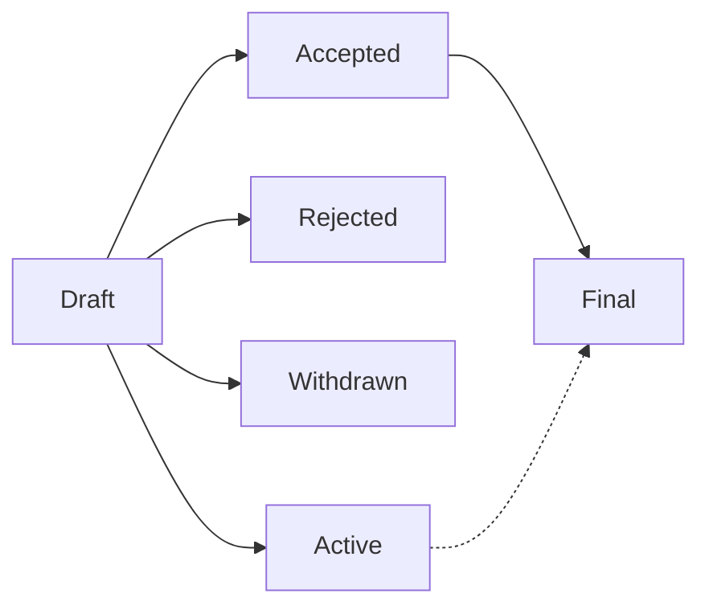

# P4PER#4 - P4PER Purpose and Guidelines

---
!!! info

    - **Author**:
        Bili Dong ([@qobilidop]),
        Fabian Ruffy ([@fruffy]),
        Steffen Smolka ([@smolkaj]),
        Andy Fingerhut ([@jafingerhut])
    - **Tracking issue**: [p4lang/p4per#4](https://github.com/p4lang/p4per/issues/4) (2026-04-12)
    - **Type**: Process
    - **Status**: Draft
    - **Changelog**
        - [p4lang/p4per#7](https://github.com/p4lang/p4per/pull/7) (2026-05-30) - First draft.
---

[@fruffy]: https://github.com/fruffy
[@jafingerhut]: https://github.com/jafingerhut
[@qobilidop]: https://github.com/qobilidop
[@smolkaj]: https://github.com/smolkaj

## What is a P4PER?

P4PER stands for P4 Project Enhancement Request. A P4PER is a design document providing information to the P4 community, or describing a new feature for P4 or its processes or environment. The P4PER should provide a concise technical specification of the feature and a rationale for the feature. The P4PER author is responsible for building consensus within the community and documenting dissenting opinions.

For now (as of May 2026), P4PER is opt-in rather than mandatory: use it when it helps with presentation, discussion, coordination, or record-keeping. We may revisit this once the community has more experience with the process.

## P4PER number

A P4PER is uniquely identified by a number. To refer to a P4PER, use the format P4PER#N where N is the P4PER number. For example, this P4PER is P4PER#4.

For how to get the P4PER number, see the [P4PER submission](#p4per-submission) section.

## P4PER types

There are three types of P4PER:

1. A **Technical** P4PER describes a new feature or implementation for P4. It may also describe any technical design broadly related to P4. Once accepted, implementations of the described feature are expected to conform to it.
2. An **Informational** P4PER describes a P4 design issue, or provides general guidelines or information to the P4 community, but does not propose a new feature. Informational P4PERs do not necessarily represent a P4 community consensus or recommendation, so users and implementers are free to ignore Informational P4PERs or follow their advice.
3. A **Process** P4PER describes a process surrounding P4, or proposes a change to (or an event in) a process. Process P4PERs are like Technical P4PERs but apply to non-technical areas. They often require community consensus. Unlike Informational P4PERs, they are more than recommendations, and users are typically not free to ignore them.

## P4PER workflow

### P4 Technical Steering Team

The current members of the [P4 Technical Steering Team (TST)](https://p4.org/governance/) are responsible for administering the P4PER process, including keeping this document up to date. For anything unclear in practice, reach out to the P4 TST as the final authority.

### P4PER roles

The following roles are involved:

- **Author**: One or more authors of the P4PER document.
- **Champion**: One of the authors, responsible for coordinating all work related to a P4PER and getting them done. The creator of a [P4PER tracking issue](#p4per-submission) becomes that P4PER's champion automatically.
- **Editor**: Eligible individuals responsible for managing the administrative (e.g. identifying an appropriate approver) and editorial (e.g. spelling, formatting) aspects of the P4PER workflow. Editors don't pass judgement on whether a P4PER should be accepted. Editors can overlap with authors.
- **Approver**: Eligible individuals responsible for making the decision on whether a P4PER should be accepted or not, on behalf of the P4 community. Approvers cannot overlap with authors, but can overlap with editors.

The following individuals are eligible editors and approvers:

- Current P4 TST members.
- Current [P4 Working Groups (WG)](https://p4.org/working-groups/) chairs.
- Any other individuals appointed by P4 TST members or P4 WG chairs for a specific P4PER.

### P4PER status

- **Draft**: The P4PER is committed to the repo for public review with an editor's approval, but is not yet accepted.
- **Accepted**: The P4PER is accepted with approver approval, but the implementation is not fully complete.
- **Final**: The P4PER is accepted with approver approval, and the implementation is fully complete.
- **Rejected**: The P4PER is rejected after approver's review.
    - We want to keep rejected P4PERs as historical record.
- **Withdrawn**: The P4PER author(s) have withdrawn the proposed P4PER.
    - We want to keep withdrawn P4PERs as historical record.
    - A withdrawn P4PER can be resurrected as a new P4PER (with a different P4PER number) later.
- **Active**: The P4PER is a continuously updated living document, and accepted with approver approval.
    - An Active P4PER can transition to Final, if it's no longer expected to be a living document.

Typical P4PER status progressions are illustrated below. In practice, it can be more flexible. For example, it's totally fine to submit a Final P4PER in a single PR. When in doubt, just [send the PR](#p4per-submission), and we'll sort things out in the review process.

### P4PER submission

1. **Create a tracking issue for the P4PER**
    - The P4PER champion opens an issue in the [P4PER GitHub repo](https://github.com/p4lang/p4per).
        - Example: <https://github.com/p4lang/p4per/issues/4>
    - The issue number becomes the [P4PER number](#p4per-number).
    - Request that an [editor](#p4per-roles) be assigned for this P4PER.
    - Cross-link this issue with any related PRs or issues.
    - General discussion about this P4PER can happen in this issue.
2. **Create/update/implement the P4PER with PRs**
    - The P4PER champion is responsible for creating PRs to create/update the P4PER, and follow through the review process to get the PRs merged.
        - Example: <https://github.com/p4lang/p4per/pull/7>
        - If the PR leaves the P4PER in Draft status, simply ask the editor to review this PR. A single editor's approval is sufficient for merging.
        - If the PR moves the P4PER beyond Draft status, ask the editor to assign one or more [approvers](#p4per-roles) to review this PR. All approvers' approvals are required for merging.
    - If this P4PER requires implementation, the P4PER authors are responsible for coordinating the implementation with PRs in the relevant project repos (e.g. [P4C](https://github.com/p4lang/p4c), [P4Runtime](https://github.com/p4lang/p4runtime)).

## Prior art

The P4PER process was directly inspired by [Python Enhancement Proposals (PEPs)](https://peps.python.org/). The writing of this document drew heavily from the following meta documents that play the same role in their respective communities:

- [Python's PEP 1](https://peps.python.org/pep-0001/)
- [Ethereum's EIP-1](https://eips.ethereum.org/EIPS/eip-1)

See also other community proposal processes that readers may find useful as additional prior art:

- [IETF RFCs](https://www.rfc-editor.org/)
- [Rust RFCs](https://github.com/rust-lang/rfcs)
- [Kubernetes KEPs](https://github.com/kubernetes/enhancements)
