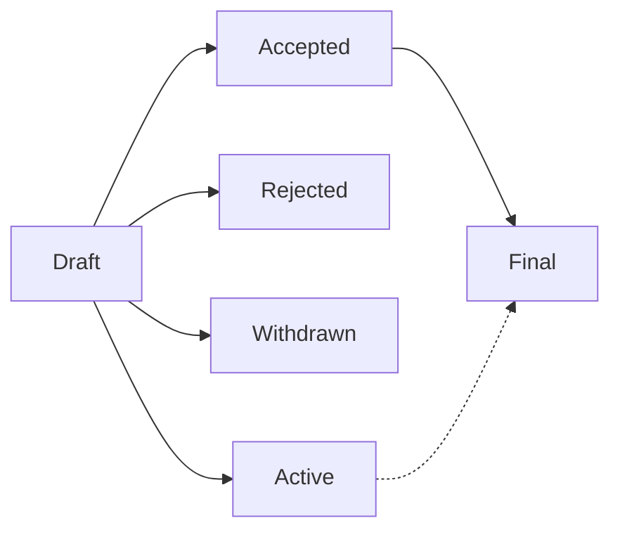

# P4PER-4: P4PER Purpose and Guidelines

---
!!! info

    - **Author**:
      Bili Dong ([@qobilidop]),
      Fabian Ruffy ([@fruffy]),
      Steffen Smolka ([@smolkaj]),
      Andy Fingerhut ([@jafingerhut])
    - **Issue**: [p4lang/p4per#4](https://github.com/p4lang/p4per/issues/4)
    - **Created**: 2026-04-27
    - **Type**: Process
    - **Status**: Draft
---

[@fruffy]: https://github.com/fruffy
[@jafingerhut]: https://github.com/jafingerhut
[@qobilidop]: https://github.com/qobilidop
[@smolkaj]: https://github.com/smolkaj

## What is a P4PER?

P4PER stands for P4 Project Enhancement Request. A P4PER is a design document providing information to the P4 community, or describing a new feature for P4 or its processes or environment. The P4PER should provide a concise technical specification of the feature and a rationale for the feature. The P4PER author is responsible for building consensus within the community and documenting dissenting opinions.

For now, P4PER is opt-in rather than mandatory: use it when it helps with presentation, discussion, coordination, or record-keeping. We may revisit this once the community has more experience with the process.

## P4PER number

A P4PER is uniquely identified by a number. To refer to a P4PER, use the format P4PER-N where N is the P4PER number. For example, this P4PER is P4PER-4.

To get a unique number for your P4PER, create an issue in the [P4PER GitHub repo](https://github.com/p4lang/p4per), and use that issue number as your P4PER number.

## P4PER types

There are three types of P4PER:

1. A **Technical** P4PER describes a new feature or implementation for P4. It may also describe any technical design broadly related to P4. Once accepted, implementations of the described feature are expected to conform to it.
2. An **Informational** P4PER describes a P4 design issue, or provides general guidelines or information to the P4 community, but does not propose a new feature. Informational P4PERs do not necessarily represent a P4 community consensus or recommendation, so users and implementers are free to ignore Informational P4PERs or follow their advice.
3. A **Process** P4PER describes a process surrounding P4, or proposes a change to (or an event in) a process. Process P4PERs are like Technical P4PERs but apply to non-technical areas. They often require community consensus. Unlike Informational P4PERs, they are more than recommendations, and users are typically not free to ignore them.

## P4PER workflow

### P4 Technical Steering Team

The current members of the [P4 Technical Steering Team (TST)](https://p4.org/governance/) are responsible for administering the P4PER process, including keeping this document up to date. For anything unclear in practice, reach out to the P4 TST as the final authorities.

### P4PER roles

The following roles are involved:

- **Author**: One or more authors of this P4PER.
- **Champion**: One of the authors, responsible for creating the P4PER PR and actively working with editors and approvers to get the PR merged. The P4PER PR creator becomes the P4PER champion (for that PR) automatically. P4PER champions could change between different PRs.
- **Editor**: Eligible individuals responsible for managing the administrative and editorial (e.g. spelling, formatting, styling) aspects of the P4PER workflow. The editors don't pass judgement on whether a P4PER should be accepted or not. To keep things lightweight, the editor could be one of the authors.
- **Approver**: Eligible individuals responsible for making the decision on whether a P4PER should be accepted or not. The approver has to be different from all the authors.

The following individuals are eligible editors and approvers:

- Current P4 TST members.
- Current [P4 Working Groups (WG)](https://p4.org/working-groups/) chairs.
- Any other individuals appointed by P4 TST members or P4 WG chairs for a specific P4PER.

### P4PER status

- **Draft**: The P4PER is well-formatted and merged into the repo, but not yet approved.
- **Accepted**: The P4PER is approved, but the implementation is not fully complete.
- **Final**: The P4PER is approved, and the implementation is fully complete.
- **Rejected**: The P4PER is rejected after approver's review.
- **Withdrawn**: The P4PER author(s) have withdrawn the proposed P4PER. This status has finality and can no longer be resurrected using this P4PER number. If the idea is pursued at a later date, it is considered a new proposal.
- **Active**: The P4PER is a continually updated living document, and it is approved. An active P4PER can also be turned into a final status if it's no longer expected to be a living document.

### P4PER lifecycle

A P4PER goes through these stages:

1. **Reserve a number**: The champion opens an issue in the [P4PER GitHub repo](https://github.com/p4lang/p4per) and uses the issue number as the P4PER number.
2. **Submit a draft**: The champion opens a PR adding P4PER-N. An editor reviews and merges the PR as **Draft**.
3. **Refine the draft**: While in **Draft**, the champion iterates on the document via subsequent PRs in response to community feedback. Discussion typically happens in the tracking issue or PR comments. The champion is responsible for asking the editor (and optionally the approver) to review and merge the PRs. This may take many iterations and does not change the status.
4. **Get a decision**: Once the Draft is ready for a decision, the champion opens a PR updating the status field. The approver reviews and decides on **Accepted**, **Active**, or **Rejected**.
5. **Mark complete**: Once the accepted P4PER's implementation is complete, the champion opens a PR marking its status as **Final**. The approver reviews and merges the PR.

The champion may withdraw a Draft P4PER by opening a PR marking its status as **Withdrawn**. An editor reviews and merges the PR.

## History

This document was derived heavily from [Python's PEP 1](https://peps.python.org/pep-0001/) and [Ethereum's EIP-1](https://eips.ethereum.org/EIPS/eip-1). In many places text was simply copied and modified.
